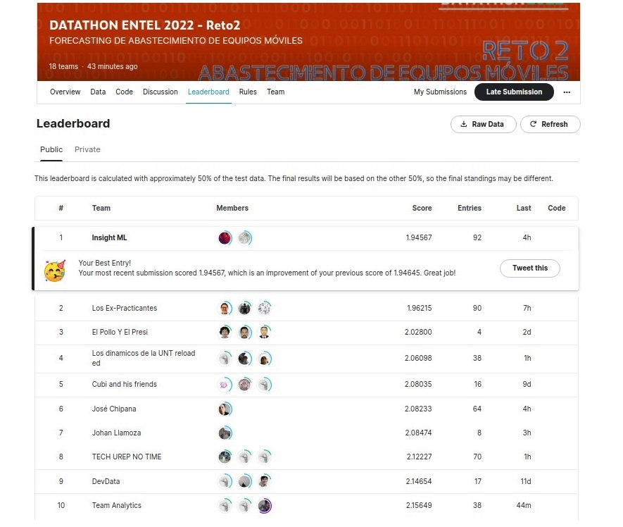
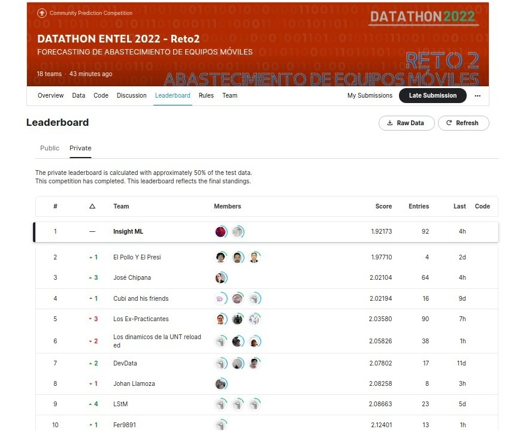

    

Desarrollado por:<b> Insight ML 🏆</b>

    <b>Integrantes</b> 
    <ul>
        <li>Renato Castro Cruz</li>
        <li>Cristian Lazo Quispe</li>
    </ul>

<h2>Descripción del reto</h2>

    
El reto consiste en desarrollar un algoritmo que prediga la demanda de un modelo en un punto de venta de acuerdo a su gama semanalmente, sin usar herramientas, aplicaciones y/o API de paga y además de no generar gastos. <b>Esto es una restricción muy importante</b>

<h2>Descripción del dataset</h2>

    Se va a predecir a nivel de semana y se tiene los siguientes archivos:

Files
    <ul>
        <li>train.csv - Data de entrenamiento. Desde la semana 1 (17/05/2021-23/05/2021) hasta la semana 50 (25/04/2022- 1/05/2022)</li>
        <li>test.csv - Data de test. Desde la semana 51 (2/05/2022-8/05/2022) hasta la semana 60 (4/07/2022-10/07/2022)</li>
        <li>test_sample.csv - Un ejemplo de submission en el formato correcto</li>
    </ul>

    
    

    <ul>
        <li>Z_MARCA - Marca del equipo</li>
        <li>Z_GAMA - Gama del equipo</li>
        <li>Z_MODELO - ModeloZ_MODELO - Modelo</li>
        <li>Z_DEPARTAMENTO - Departamento del Perú del punto de venta</li>
        <li>Z_PUNTO_VENTA - Punto de venta a abastecer</li>
        <li>SEMANA_XX - Semana de abastecimiento de acuerdo con el modelo, punto de venta y gama</li>
    </ul>

    

<h2>Target</h2>

    
Se pide determinar la demanda semanal de un modelo en un punto de venta de acuerdo a su gama.

<h2>Evaluación</h2>

    
Se evaluará a los participantes en función del RMSE, de menor a mayor. Durante la competencia se reportarán resultados sobre un subconjunto del set de evaluación (50%), pero los resultados finales se calcularán sobre los datos restantes (50%)

<h2>Formato del Kaggle Submission</h2>

    
Para todos los participantes, los archivos subidos deberán tener las siguientes columnas: ID yDemanda. Tener en cuenta que el valor de "Demanda" hace referencia al valor forecasteado. Al mismo tiempo, la estructura de la variable "ID" es Modelo|Punto de venta|Gama|# Semana.

   
El formato del archivo será el siguiente:

<pre><code>ID,Demanda
XXXX|PDV1|XXXX|Semana 55,1
XXXX|PDV1|XXXX|Semana 56,2
XXXX|PDV1|XXXX|Semana 57,3
</code></pre>

    <h2> Leaderboard de nuestra propuesta 🏆 </h2>
    <b><h4>Nuestra solución logró el primer puesto en ambos leaderboards tanto público como privado demonstrando que nuestro modelo es robusto y no tuvo problemas de overfitting.</h4></b>
    
    

    <h2>Procedimiento</h2>
    <ol>
        <li>Instalar con <code>pip install -r requirements.txt</code> las librerías necesarias para correr los scripts de Python/o/Notebooks. (Ver Recomendación 1)</li>
        <li>En la carpeta <b>notebooks</b>, correr el notebook 1.Preprocessing.ipynb o el script Preprocessing.py. (Ver Recomendación 3)</li>
        <li>En la carpeta <b>notebooks</b>, correr el notebook 2.Modeling_Prophet_Ratios.ipynb o el script Modeling_Prophet_Ratios.py. (Ver Recomendación 2)</li>
        <li>En la carpeta <b>notebooks/Forecasting_por_semanas</b>, correr el notebook 3.PreprocesamientoTemporal.ipynb y 4.CreacionDatasetTemporal.ipynb o sus scripts .py homólogos (Ver Recomendación 2).
        <li>Alternativamente si se desea ahorrar el uso de memoria RAM y tiempo (2 horas aprox.) para el procesamiento temporal de la data, puede omitir el paso 3 y descargar todos los archivos de la siguiente ruta: https://drive.google.com/drive/u/1/folders/1ZYyjUH2FAHhVYJ9avH_GFFhOjAP_ekRV</li>
        <li>En la carpeta <b>notebooks/Forecasting_por_semanas</b>, correr los notebooks 5.Entrenamiento_modelo1.ipynb, 6.Entrenamiento_modelo2.ipynb y 7.Ensamblaje_de_modelos.ipynb en ese orden o correr sus scripts homólogos. (Ver Recomendación 2)</li>
        <li>Los valores de la predicción del forecasting se encontrarán en la carpeta Results con el nombre <code>submission_model_final.csv</code>
    </ol>

    <h2>Recomendaciones</h2>
    <ol>
        <li>Se recomienda instalar las librerías desde una terminal como anaconda prompt en Windows o Linux/MAC terminal ya que correrlo desde los notebooks puede tener problemas.</li>
        <li>Se recomienda correr el proyecto usando los notebooks para sacarle provecho a todo el análisis realizado y la propuesta del modelo.</li>
        <li>En el caso del notebook Preprocessing si gusta puede optar por el script Preprocessing.py ya que no se tiene mucho análisis de datos.</li>
    </ol>

    <h2>Lenguajes de Programación, Librerías, Frameworks a usar</h2>

    Lenguajes de Programación:
    <ul>
        <li><a href='https://www.anaconda.com/'>Anaconda - Python</a></li>
    </ul>

    Frameworks y librerías:
    <ul>
        <li><a href='https://scikit-learn.org/stable/'>Scikit-learn</a>, <a href='https://pandas.pydata.org/'>Pandas</a>, <a href='https://numpy.org/'>Numpy</a></li>
        <li> <a href='https://xgboost.ai/'>XgBoost</a>, <a href='https://catboost.ai/'>CatBoost</a></li>
        <li><a href='http://seaborn.pydata.org/'>Seaborn</a>, <a href='https://plotly.com/python/'>Plotly</a></li>
        <li><a href='https://facebook.github.io/prophet/'>Prophet</a></li>
    </ul>

<b>Recursos que nos ayudaron en el desarrollo del proyecto:</b>

    Kaggle Competitions:
    <ul>
        <li><a href='https://www.kaggle.com/competitions/m5-forecasting-accuracy'>M5 Forecasting Accuracy 2020</a></li>
        <li><a href='https://www.kaggle.com/competitions/store-sales-time-series-forecasting'>Store Sales - Time Series Forecasting</a></li>
    </ul>

    Videos:
    <ul>
        <li><a href='https://www.youtube.com/watch?v=VYpAodcdFfA'>Two Effective Algorithms for Time Series Forecasting</a></li>
        <li><a href='https://www.youtube.com/watch?v=pOYAXv15r3A'>Forecasting at Scale: How and Why We Developed Prophet for Forecasting at Facebook</a></li>
    </ul>

